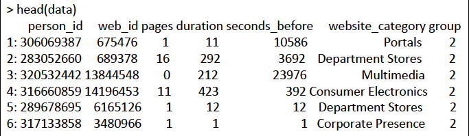

My name is Shijia Xie. I am in the M.P.S in Applied Statistics Program. This is a one year program, so I am graduating this coming May. 

I am taking this course because Bayesian Analysis is a very important branch in data analysis, and this method can be applied to many fileds, such as spelling corrector, model comparasion, analysis by synthesis, and naive Bayes spam filtering. Another reason is because I can hardly learn this methodology from other statistics courses.

I am interested in how to analyze an imbanlanced dataset, which includs different number of observations in various categorical data. For example, to analyze the online behavioral pattern of a retailer, there are 10,000 visitors and 20,000 non-visitors. I try to predict the variables that affect whether one is a visitor or non-visitor. 

 